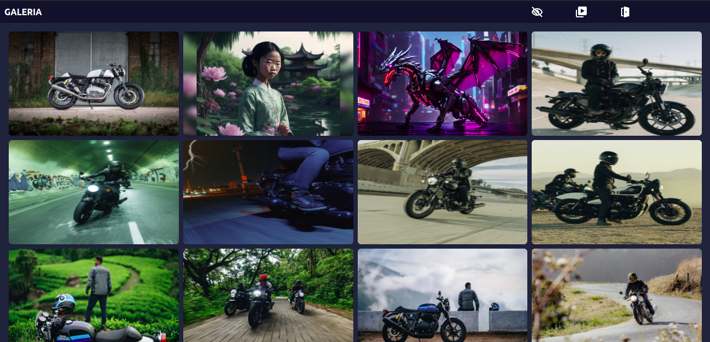
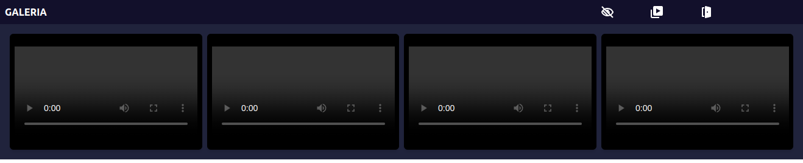

# Photo Gallery Project
Description
This project is a simple photo gallery built using HTML, Tailwind CSS, and jQuery. It allows users to view and navigate through a collection of images.

# Badges
Badge en DesarolloGitHub Org's stars

# Índice
Título e imagen de portada
Insignias
Índice
Descripción del proyecto
Estado del proyecto
Características de la aplicación y demostración
Acceso al proyecto
Tecnologías utilizadas
Personas Contribuyentes
Personas-Desarrolladores del Proyecto
Licencia
Conclusión

## Description of the Project
This project is a simple photo gallery built using HTML, Tailwind CSS, and jQuery. It allows users to view and navigate through a collection of images.

## Status of the Project
The project is currently under development.

## Features and Demonstration
The photo gallery features a responsive design, allowing users to view images on various devices. It also includes navigation buttons to move through the images.

## Access to the Project
To access the project, clone the repository and run the following commands:

sh
Edit
Copy code
npm install --global gulp-cli@2
gulp

## Technologies Used
HTML
Tailwind CSS
jQuery
Gulp

## Contributors
Chris Uriel Dominguez Pineda

## License
This project is licensed under the MIT License.

## Conclusion
This project is a simple photo gallery built using HTML, Tailwind CSS, and jQuery. It allows users to view and navigate through a collection of images.